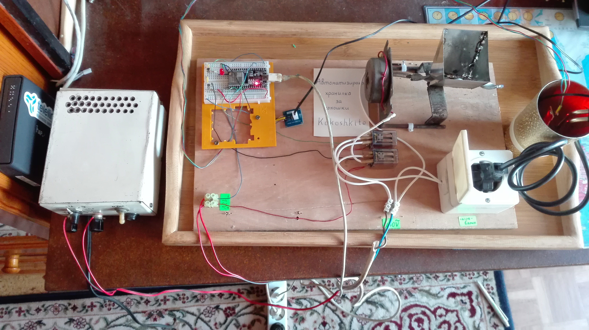

# *kokoshkite* - автоматизирана хранилка за кокошки

*Нуждата от хранене на кокошките през зимата бе основната ни мотивация за създаването на проекта. Предназначен е за хората, които искат да отглеждат кокошки през зимата, но не могат постоянно да бъдат до тях. С него целим да променим концепцията за отглеждане на кокошки през зимата. Главната му функционалности са да храни кокошките през определено време и да топли водата им, когато е студено. Изпраща информация в интернет за нивото на водата и храната. Най-трудната част от проекта беше управляването на моторите чрез релета. Гордеем се с това, че успяхме да автоматизираме част от селската работа.*

## Използвани технологии: 

* Django - https://www.djangoproject.com/

* Django REST Framework - https://www.django-rest-framework.org/

* ESP32 Development board - https://www.espressif.com/en/products/socs/esp32

* Arduino IDE - https://www.arduino.cc/en/software

* Arduino Language - https://www.arduino.cc/reference/en/

* Python - https://www.python.org/ 

## Автори:

* **Йоан Джелекарски** - *програмист* 

* **Калоян Пашов** -  *програмист*  

## [Презентация](https://docs.google.com/presentation/d/1_ub661ZjPfPwVCvMnsOkQ0IjdUP1NhYqDO2c_vK88tk/edit?usp=sharing)

